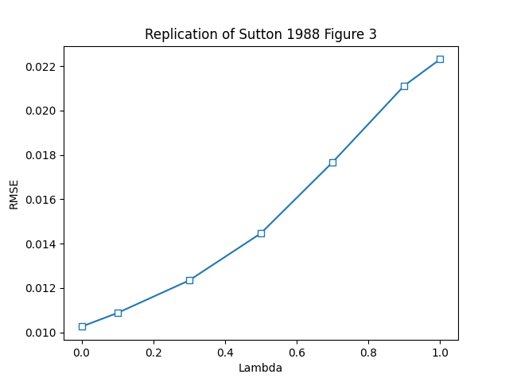
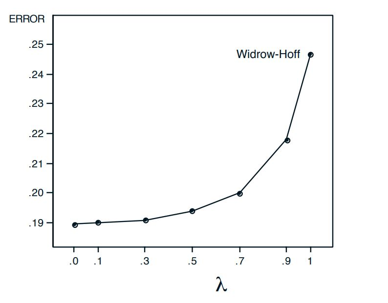
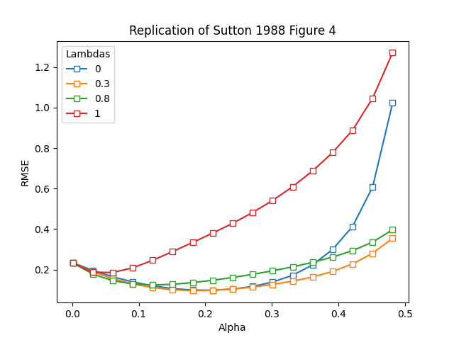
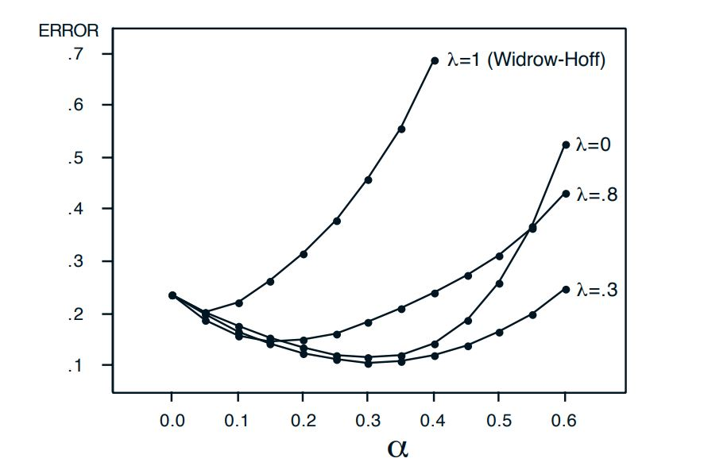
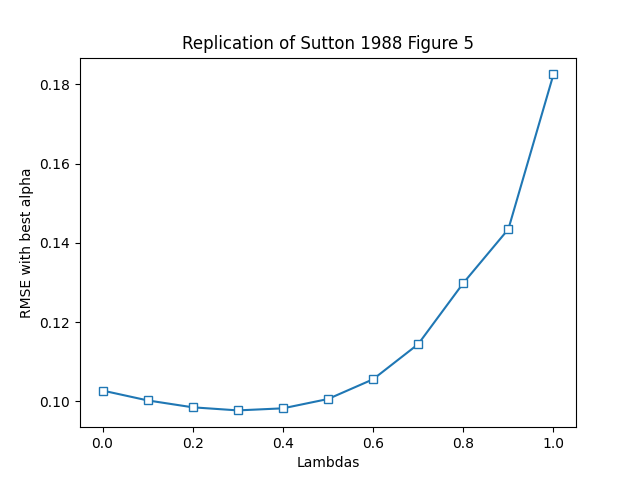
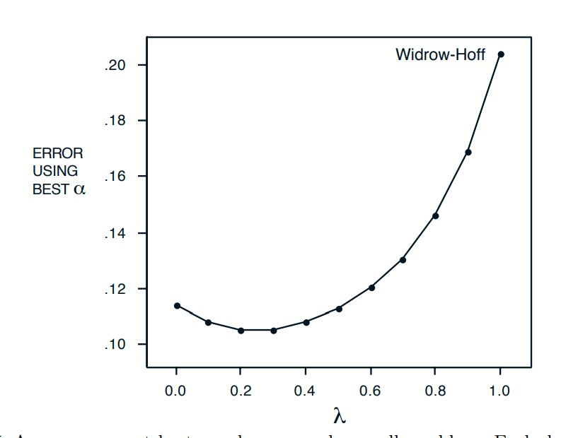

# **Sutton 1988 TD Lambda Reproduction**

The goal of this project is to reproduce figures out Richard Sutton's 1988 paper, [Learning to Predict by Methods of Temporal Differences](http://incompleteideas.net/papers/sutton-88-with-erratum.pdf)

For the most part, patterns noted in the original publication were reproducible, though the actual numbers are different in some cases likely due to differences in sampling/hyperparameters.

## TD ($\lambda$) Overview

In TD($\lambda$), predictions and weight vectors are updated by considering the changes in prediction at time t $P_t$ and the next iteration $P_{t+1}$. The most recent predictions are weighted more heavily, and earlier predictions are exponentially discounted by a factor of $\lambda$. The weight update rule for this algorith is as follows:
$$
\begin{align}
    \triangle w_t = \alpha (P_{t+1} - P{t})\sum^t_{k=1}\lambda^{t-k}\nabla_wP_k
\end{align}
$$

Where $\triangle w_t$ is the weight update and $\alpha$ is the learning rate hyperparameter. By utilizing the exponentially decaying lambda, we are also able to compute these updates incrementally using the eligibility trace, which is updated as follows:
$$
\begin{align}
    e_{t+1} = \nabla P_{t+1} + \lambda e_t
\end{align}
$$

This algorithm, in effect, is also the weighted combination of all n-step predictors in a n-step Markov decision process.

In this experiment, figures 3, 4, and 5 of the original paper were reproduced using the bounded random walk experiment presented in Sutton's original paper.

A random walk is represented by a matrix in which each row represents a state that the agent visited. Each row of the matrix is a one hot encoded vector where $x_i = 1$ if the agent is in state i, and 0 otherwise. This representation made updating the weights convenient as we could just utilize the dot product between the weights and observations for the weight updates. As in the paper, 100 training sets, each consisting of 10 walks was generated for use by all algorithms.

## Figure 3 - Repeated Representation Training

Rather than update the weight vector after each sequence, weight updates were "accumulated" and then only updated after each batch of training data. Training data was presented until the algorithm converged

This experiment showed that TD($\lambda$) algorithms with $\lambda < 1$ outperformed TD(1) and Widrow-Hoff update rules, which result in the same updates applied in this case, by the metric of root mean squared error (RMSE). This is because Widrow-Hoff update rules only consider the training set and result, while TD($\lambda$) algorithms consider the benefit from future rewards.
## Figure 4 - Optimal Learning Rates
In the second experiment, Sutton looked at the effect of learning rate parameter $\alpha$ when the training set is just presented once rather than repeated until convergence. Also, rather than accumulating weight updates over a batch of 10 walks, the weight updates were performed online after a single sequence was presented. This experiment was performed over a varying amount of alphas for $\lambda$ = 0, 0.3, 0.8 and 1.0.

## Figure 5 - Best $\lambda$ with Fixed Optimal$\alpha$

Various lambda values for the same online weight update rule used in the previous section, found the best learning rate for each, and then plotted the average error over 100 training sets. For this experiment, it was noted that optimal $\lambda$ is actually near 0.3, outperforming TD(0). Even  though TD(0) is most consistent with the underlying Markov process, it did not end up being optimal for this experiment as it is slower than other methods with $\lambda > 0$ at propagating reward experience back up the sequence

